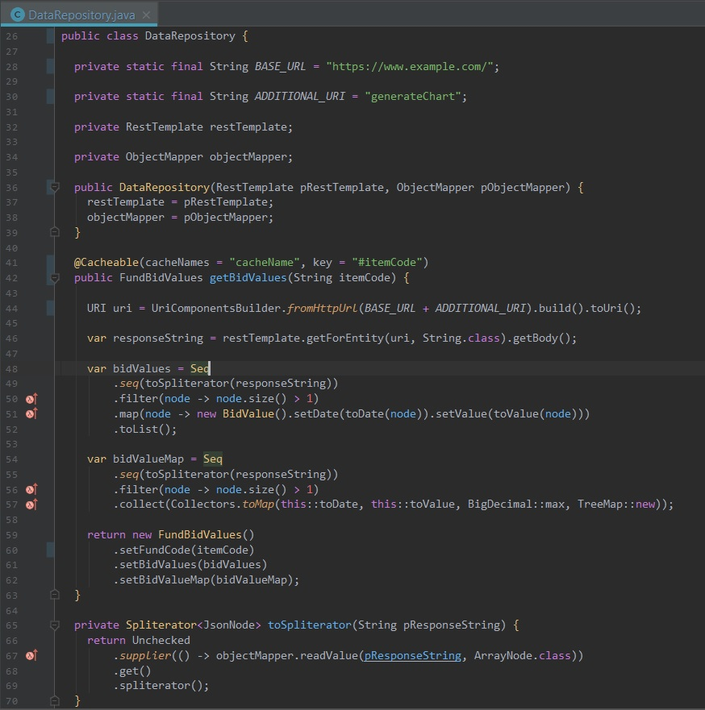

# One Dark Inspired IntelliJ IDEA theme

[One Dark](https://github.com/atom/one-dark-syntax) inspired Java editor theme for for IntelliJ IDEA

## Installation

### Install color theme using "Import Settings..."

1. Go to `File | Import Settings...` and specify the `idea-darcula-one-dark-theme` directory or the `Darcula One Dark.jar` file.
 Click `OK` in the dialog that appears.

2. Restart IntelliJ IDEA

3. Go to `Preferences | Editor | Colors & Fonts` and select the new color theme.

## Optional Google Inspired Java code style
### Install code style using "Import Settings..."

1. Go to `File | Settings... | Editor | Code Style` and choose to `Import Scheme...` and specify the `GoogleInspiredStyle.xml` file.
 Click `OK` in the dialog that appears.

2. Restart IntelliJ IDEA

3. Go to `File | Settings... | Editor | Code Style` and select the new code style.
